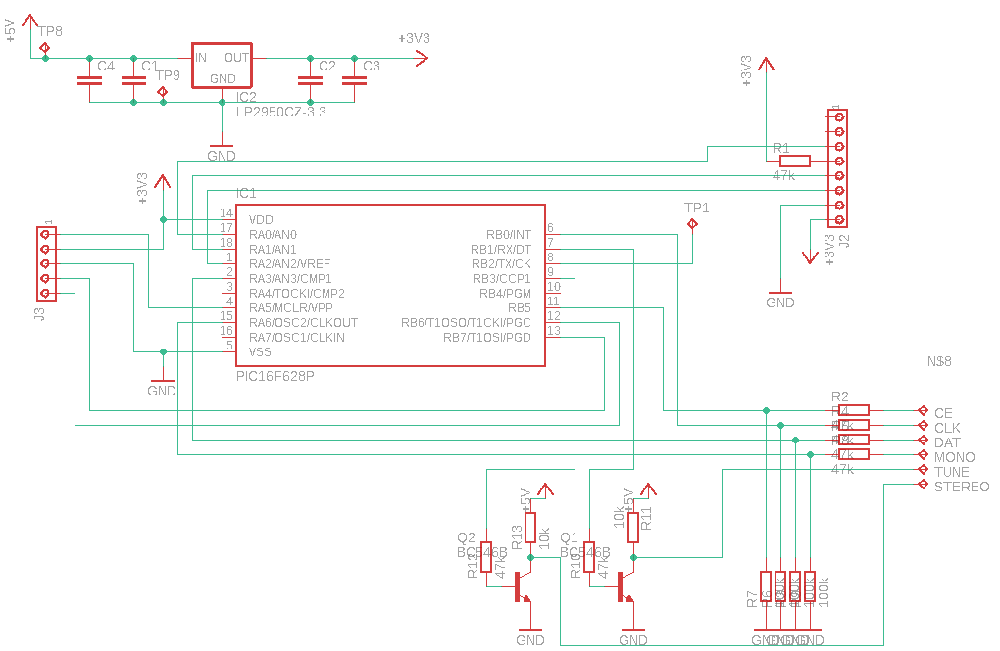
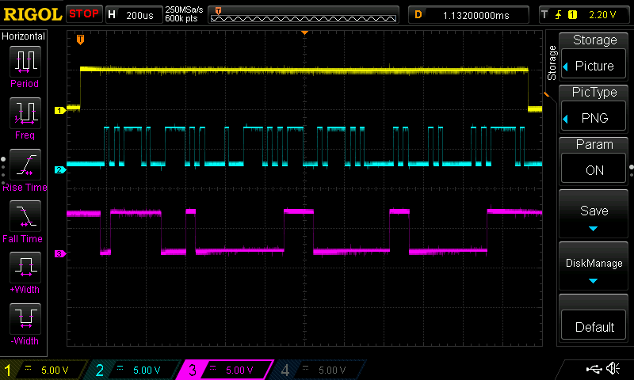
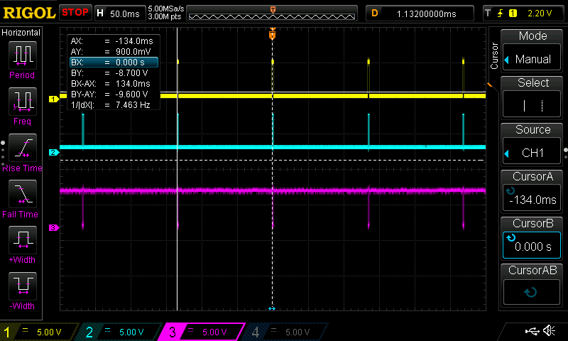
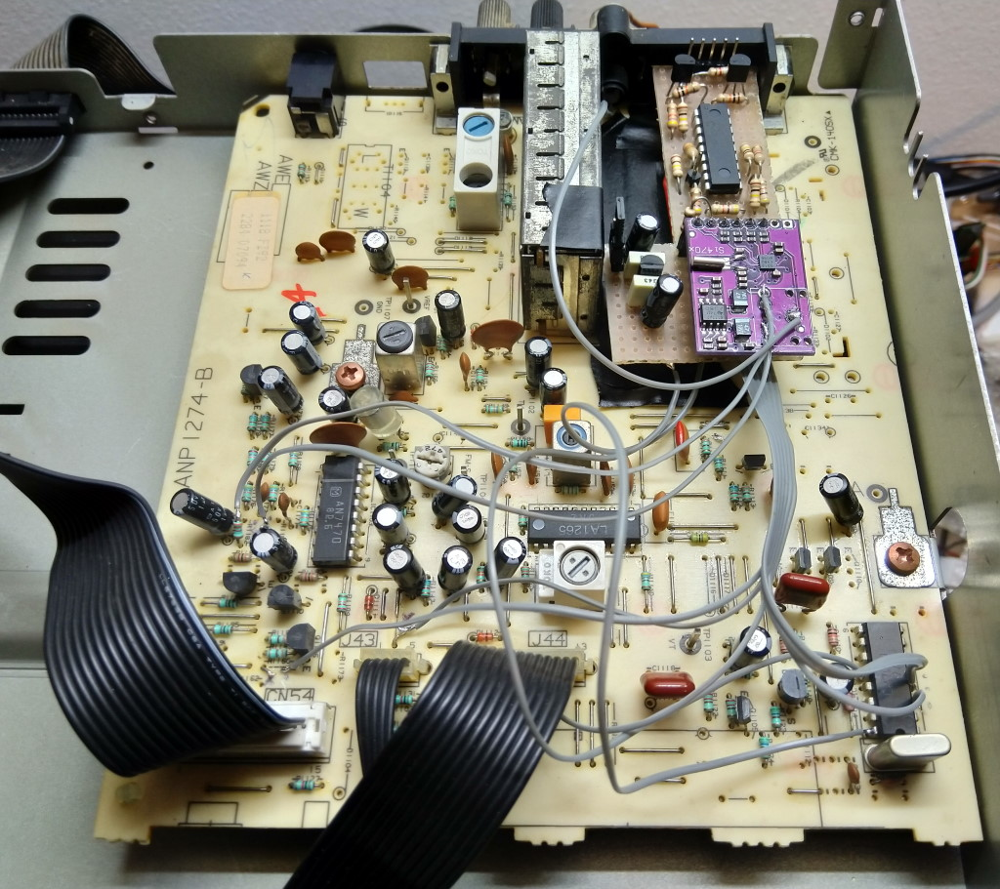

# LM7001 FM tuner board upgrade to Si470x 

## Why

I needed a simple replacement for a vintage Pioneer Hi-fi radio tuner that tends to mute quite often. As most Pioneer units of 90's era, his MCU is the core part of the whole system (it receives the IR commands, it displays messages and implements the wake-up timers).

Luckily, the malfunctioning tuner board is based on the LM7001, a direct digital PLL synthesizer with simple serial interface. The PLL works perfectly, so the issue with the jittering sound should be in some other part of the tuner board.

After some hours spent to try to repair the board, I went for the simplest digital upgrade.

## The Silicon Labs module

It is very easy now to found a complete FM tuner with RDS for a couple of dollars from China suppliers. 

The most common core chip is the [Si4702](https://www.silabs.com/audio-and-radio/fm-radios/si4702-03-radio-receivers) from Silicon Labs.

His I2C interface makes it suitable for interfacing to virtually any MCU.

It exposes the mono/stereo state and the tuned flags via I2C: what we need to allow the original Pioneer display to show such information to the user, and to allow auto-scan.

## The Microchip MCU as interface

The computational power to decode the Pioneer MCU commands sent to the LM7001 requires little resources. So I picked up a discontinued but handy 4MHz PIC16F628 from my stock.

> Note: this old PIC supports very little debug facilities. In addition it doesn't support ICSP programming at 3.3V (WTF), so I added a manual jumper to in-circuit program my prototype. Consider any newer non-discontinued 8-bit PIC MCU as an upgrade for your projects. 

In addition to decode the signals to control the LM7001, I wired the MONO signal and sent back the TUNED and STEREO lines as well. In that way all the Pioneer unit functions are fully functionals (all but the AM band).

The 5V TTL lines are converted to 3.3V inputs with resistors, and the two output converted back with a couple of NPNs.

The LM7001 lines are sampled using interrupts (RB0/INT for the chip enable line that triggers the start of transmission, and RB change for the clock line).

_The Pioneer MCU probably implemented the transmission in firmware due to the jittering of the high CLK line._

*IMPORTANT*: The response time from the end of tuning command to when the TUNED signal is drive high in case of valid FM station should be fast enough in order to let the Pioneer MCU to properly scan the frequencies in auto-scan mode.

_In that case, it seems that the unit auto-scans with an interval of ~130ms._

## The final result

The modification here - not looking so professional with all these wires around - is however completely reversible for future reworks.

The board is manaully wired on a small piece of a prototype board to save bucks (but not to save time).

It is fascinating to note that the whole tuner board now fits in the smaller 2x2mm chip in the purple module! The other bigger SSOP8 chip is the on-board headphone amplifier that I didn't even bother to remove.

